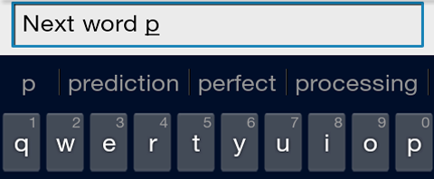

```{r, options_chunk, include=FALSE}
library(knitr)
knitr::opts_chunk$set(fig.width=6, fig.height=6, fig.path='Figs/',
                      echo=FALSE, warning=FALSE, message=FALSE, cache=TRUE)
setwd("C:/Users/oli.bailey/Documents/MyStuff/Stats/Coursera/DSS/10. Datascience Capstone/Milestone Report")
```

```{r, load_libs}
library(tidyverse) # for wrangling and visualization
library(tidytext) # for text mining
```

```{r, utility_functions}
# Create custom %notin% operator
`%notin%` <- Negate(`%in%`)

load_file <- function(fp) {
  f <- readLines(fp)
  # Remove unicode:
  f <- iconv(f, "latin1", "ASCII", sub="")
  close(fp)
  return(f)
}

get_MB <- function(obj) {
   s <- format(object.size(obj), units = "Mb")
   return(parse_number(s))
}

get_ngram <- function(doc, n = 2) {
  ngrams <- doc %>%
    unnest_tokens(ngram, lines, token = "ngrams", n = n)

  return(ngrams %>% count(ngram, sort = TRUE))
}

create_dict <- function(doc, stop_words=stop_words_profanity) {
  data_frame(text = doc) %>% 
    #mutate(text = tolower(text)) %>%  # DONE WHEN FILE LOADED
    mutate(text = str_remove_all(text, '[\\.,><?!"£\\$%\\^&\\*_;:\\(\\)]')) %>% 
    mutate(tokens = str_split(text, "\\s+")) %>%
    unnest() %>% 
    count(tokens) %>%
    mutate(freq = n / sum(n)) %>% 
    arrange(desc(n)) -> dict_freq
  if (!is.null(stop_words)) {
    # Remove stop words from data. This can include profanity.
    dict_freq %>%
      filter(!tokens %in% stop_words) -> dict_freq
  }
  return(dict_freq)
}
```
# Introduction
Around the world, people are spending an increasing amount of time on their mobile devices for email, social networking, banking and a whole range of other activities. But typing on mobile devices can be a serious pain. When someone types:

*I went to the*

the keyboard presents three options for what the next word might be. For example, the three words might be *gym, store, restaurant*.

This project report is part of a larger project to design a text prediction system that could be run efficiently on a mobile device.

Here we consider only an initial analysis a large corpus of text documents, involving the  cleaning and analysis of text data, leading up to the building and sampling from a predictive text model in future project work. 

# Ultra Brief NLP Oveview
Natural Language Processing (NLP) combines knowledge from linguistics, computer science, statistics and machine learning disciplines, and concerns the interactions between computers and humans (see Wikipedia https://en.wikipedia.org/wiki/Natural_language_processing). NLP covers a wide range of uses from classification of documents, sentiment analysis, chatbots, and text prediction, among many other.

Some basic and common steps or techniques used in NLP applications are:-

* Sentence detection - breaking up text data into separate sentences.

* Tokenization -  splitting sentences in parts, typically words.

* Chunking - Deriving logical concepts from the tagged tokens within a sentence.

* Part-of-speech (POS) tagging - Tokens (words) are assigned as a noun, verb, adjective, adverb etc.

* Entity Identification/Extraction - people, locations, events, etc are extracted from the text chunks.

In our application of text prediction, issues we might face in the analysis and processing of the data are the use of colloquial or slang language  - especially from social media sources - and incorrect punctuation, as well as poor spelling. 

# N-Gram Text Prediction
Our text prediction model is based on using a very large amount of "example" text mined from various online sources, from which we can identify common patterns or phrases that occur. These patterns or phrases here consist of groups of 1,2 or 3 words (called **"n-grams"**) that frequently appear together.

This is the basis of our prediction - the user types, we search for short phrases that contain the last few words inputted by the user plus a further word or two, and we present the most "likely" next three choices.

## File Summaries
For this project we are using a set of text documents, or *corpora*, provided by HC Corpora (http://www.corpora.heliohost.org). A readme file here http://www.corpora.heliohost.org/aboutcorpus.html provides details about these corpora. 

The Coursera dataset (CAUTION: > 500MB!!) analyzed for this report is available here: https://d396qusza40orc.cloudfront.net/dsscapstone/dataset/Coursera-SwiftKey.zip. 

This set of files have had meta tags about source, date, time, etc. removed, so are purely lines of text that can be read in using readLines() for example. The files in this corpora have been filtered for language, but they may still contain some foreign language words.  

**NOTE: This data set included files in American-English, Russian, Finnish and German. Only the American-English language files are considered in this project.**

### Line and word counts
There are three input files from these sources:

* News - factual, as well as plain-word text these contain many numbers, prices, costs, email addresses, URLs
* Blogs - language that is more personal, opinion and personal experience with less "clutter"
* Twitter - short collections of a handful of sentences, containing a large proportion of slang

A summary of the raw files sizes, the object size in R, and the word and line counts is given below:

| File            | File Size | Object Size (R) | Lines Count | Word Count |
|-----------------|-----------|-----------------|-------------|------------|
|en_US.blogs.txt  | 200.4 MB  |   253.1 MB      | 899,289     | 31,073,343 |
|en_US.news.txt   | 196.3 MB  |   19.7 MB       | 1,010,243   | 35,628,125 |
|en_US.twitter.txt| 159.4 MB  |   317.7 MB      | 2,360,150   | 31,073,243 |

NOTE: The line and word counts were found using Notepad++.

These files are very large. Given that we are targeting to run our prediction app on a mobile platform,
I will aim to randomly sample lines totaling 2MB from each of the three files, and combine into one corpus of about 6MB for the remaining analysis. 6MB should be a reasonable size to generate our ngram frequency dictionaries from, and these can be further reduced by dropping very low frequency entries.

## Initial Data Preparation
We need to sample a smaller set from these three files, combine to one, and then process by removing punctuation, foul words, etc, before we can derive n-gram frequency counts for this input text.

## Combine and Sample
First, we'll randomly sample 2MB from each input file, and combine them.
```{r warning=FALSE, include=FALSE, load_files, echo=FALSE, cache=TRUE}
# Load raw input files
blogs <- load_file(file("en_US/en_US.blogs.txt"))
news <- load_file(file("en_US/en_US.news.txt"))
twitter <- load_file(file("en_US/en_US.twitter.txt"))
```

```{r eval=FALSE, warning=FALSE, include=FALSE, sample_files, echo=FALSE}
# Sample 2MB from each
desired_size_MB <- 2

set.seed(1)
reduction_factor <- get_MB(blogs) / desired_size_MB
blogs <- sample(blogs,floor(length(blogs)/reduction_factor))

set.seed(2)
reduction_factor <- get_MB(news) / desired_size_MB
news <- sample(news,floor(length(news)/reduction_factor))

set.seed(3)
reduction_factor <- get_MB(twitter) / desired_size_MB
twitter <- sample(twitter,floor(length(twitter)/reduction_factor))

combined_sample <- c(news,blogs,twitter)
```
To give a flavour of the content, here are samples of each file:

### Samples {.tabset}

#### News
```{r echo=FALSE}
set.seed(4)
base::sample(x=news,size=3)
```
#### Blogs
```{r echo=FALSE}
set.seed(5)
base::sample(x=blogs,size=3)
```
#### Twitter
```{r echo=FALSE}
set.seed(6)
base::sample(x=twitter,size=3)
```

As you can see, the raw text contain emoticons, numbers, unicode, slang, and so on.

### Remove punctuation
We will not try to perform any spelling correction or detection of foreign words, but will simply remove punctuation like parentheses, colons, semicolons, whilst leaving apostrophes and hyphens in place, as many words are hyphenated as would lose meaning or context if we strip out all hyphens.

### Convert to lower case
We will also ignore all non-alphabetic tokens like prices, urls, emails etc, and convert all text to lower case. This does mean our predictions will all be lower case, so proper nouns like people's names and place names would be in lower case if predicted.


### Remove foul words
We could write our own list of foul words to remove, but we'd have to consider all stems and forms of each word. Easier it to use an existing list, which can be found online e.g. http://www.bannedwordlist.com/lists/swearWords.txt which contains 77 very common uncouth, crude or rude words on which we don't want to make predictions.

```{r eval=FALSE, message=FALSE, include=FALSE, remove_punctuation_and_foul_words, warning=FALSE}
combined <- c(news,blogs,twitter)
combined <- data.frame(lines = combined)

# Remove punctuation
combined %>%
    mutate(lines = tolower(lines)) %>%
    mutate(lines = str_remove_all(lines, '[\\.,><?!"£\\$%\\^&\\*_;:\\(\\)]'))  -> combined

# Remove foul words
banned_words = readLines(file("http://www.bannedwordlist.com/lists/swearWords.txt"))

combined %>% 
    filter(lines %notin% stop_words) -> combined 
```


# Exploratory Analysis
The first thing to do is find the most common words (or "1-grams", in our n-gram framing for this problem). Words that occur very rarely are unlikely to be useful, and these are likely to be a large fraction of our data. 

We want to know how many unique words  account for what proportion of our sample corpus, i.e. the language coverage.

## Single words  (1-gram)
```{r, single_word_freqs, cache=TRUE}
CACHED <- TRUE

if (CACHED == TRUE) {
  load("combined.dat")
} else {

  save(combined, file="combined.dat")
}
# Create 1-gram frequency table
combined %>%
    mutate(tokens = str_split(lines, "\\s+")) %>%
    unnest() %>% 
    count(tokens) %>%
    mutate(freq = n / sum(n)) %>% 
    arrange(desc(n)) -> word_freqs

cat("Sample corpus contains",sum(word_freqs$n),"total words")
cat("Sample corpus contains",nrow(word_freqs),"unique words")
```
In our sample corpus we have over 50,000 unique "words", from nearly 3/4 of a million total words.

Let's see how many words cover 50% and 90% of the total:
```{r}
total <- sum(word_freqs$n)
i <- 1

while (sum(word_freqs$n[1:i]) < floor(total*0.5) ) {
  i <- i + 1
}

cat("To cover 50% of all words, you need",i,"words\n")

while (sum(word_freqs$n[1:i]) < floor(total*0.9) ) {
  i <- i + 1
}

cat("To cover 90% of all words, you need",i,"words\n")
```
So there may be some memory and time saving to reduce the dictionary of words in our prediction down to the order of 10,000 from the full 50,000 in our sample corpus.

## 2-grams & 3-grams
Again, for 2-grams and 3-grams, we will probably not find it useful to keep those which occur only a very few times in our corpus, instead focusing the prediction on those that occur more often. This will allow us to reduce memory and compute time. 

Below are the top ten most frequent n-grams for n-grams of lengths 1,2 and 3.

```{r, cache=TRUE}
# Generate the n-gram vs frequency tables:
CACHED <- TRUE

if (CACHED == TRUE) {
  load("ngrams_2.dat")
  load("ngrams_3.dat")
} else {
  get_ngram(combined,2) -> ngrams_2
  get_ngram(combined,3) -> ngrams_3
  save(ngrams_2, file="ngrams_2.dat")
  save(ngrams_3, file="ngrams_3.dat")
}
```

### Most Common N-Grams {.tabset}

#### 1-gram
```{r, echo=FALSE}
100*word_freqs$n[1:10]/sum(word_freqs$n) -> h
library("RColorBrewer")
bp <- barplot(height = h, beside = TRUE, main = "Top Ten Most Frequenct Words (1-grams)",
              xlab = "", 
              ylab = "Frequency (% of Total)",
              col=brewer.pal(n = 10, name = "Set3"))

text(bp, 1, word_freqs$tokens[1:10],cex=1.4,pos=1, col="black")
```


#### 2-gram
```{r, echo=FALSE}
100*ngrams_2$n[1:10]/sum(ngrams_2$n) -> h

bp <- barplot(height = h, beside = TRUE, main = "Top Ten Most Frequenct 2-grams",
              xlab = "", 
              ylab = "Frequency (% of Total)",
              col=brewer.pal(n = 10, name = "Set3"))

text(bp, 0.08, ngrams_2$ngram[1:10],
     cex=1.2,pos=1,srt=90, adj=0, col="black")
```


#### 3-gram
```{r, echo=FALSE}
100*ngrams_2$n[1:10]/sum(ngrams_3$n) -> h

bp <- barplot(height = h, beside = TRUE, main = "Top Ten Most Frequenct 3-grams",
              xlab = "", 
              ylab = "Frequency (% of Total)",
              col=brewer.pal(n = 10, name = "Set3"))

text(bp, 0.2, ngrams_3$ngram[1:10],
     cex=1.2,pos=1,srt=90, col="black")
```

### Language Coverage
Below is a graph for each n-gram size showing the percentage of total coverage versus the percentage of n-grams used, using the most frequent n-grams first (i.e. sorted in descending frequency as used in this report).

```{r, coverage_plot, echo=FALSE}
y1 <- numeric(); y2 <- y1; y3 <- y1
# 1-grams
tot1 <- sum(word_freqs$n)
nuniq1 <- nrow(word_freqs)

# 2-grams
tot2 <- sum(ngrams_2$n)
nuniq2 <- nrow(ngrams_2)

# 3-grams
tot3 <- sum(ngrams_3$n)
nuniq3 <- nrow(ngrams_3)

xvals <- c(seq(0.1,1,0.1),seq(1,100,1))

for (x in xvals) {
  pct_cover <- 100* sum(word_freqs$n[1:floor(x*nuniq1/100)])/tot1
  y1 <- c(y1,pct_cover)
  pct_cover <- 100* sum(ngrams_2$n[1:floor(x*nuniq2/100)])/tot2
  y2 <- c(y2,pct_cover)
  pct_cover <- 100* sum(ngrams_3$n[1:floor(x*nuniq3/100)])/tot3
  y3 <- c(y3,pct_cover)
}

plot(x=xvals,y1,
     xlim=c(0,100),
     ylim=c(0,100),
     xlab="% Unique n-grams used (most frequent first)",
     ylab="% Coverage of total n-grams",
     type="l",col="blue",lwd=2)
lines(x=xvals,y=y2,
      col="red",lwd=2)
lines(x=xvals, y=y3,
      col="darkgreen",lwd=2)
grid()
legend(60, 20, legend=c("1-gram", "2-grams", "3-grams"),
       col=c("blue", "red","darkgreen"), lwd=2,lty=c(1,1,1), cex=0.8)
abline(a=0,b=1, col="grey", lwd=2,lty=2)

(ngrams_2 %>% filter(n==1) %>% nrow()) / (nrow(ngrams_2)) -> prop_2_grams_once
(ngrams_3 %>% filter(n==1) %>% nrow()) / (nrow(ngrams_3)) -> prop_3_grams_once
```


We see that for individual words (1-grams), we can cover 90% of our sample corpus with only the top 20% most frequent words.

For 2-grams and 3-grams, the curves are linear and closer to the 1:1 relationship (grey dotted line), meaning we need to retain a much higher fraction of these tables to cover a good proportion of the corpus.

This is because the majority of 2-grams (~81%) and 3-grams (~94%) occur only once!


# Next Steps
This work covers only the very early stages of the predictive text app development. We have looked at text import, processing and initial study in terms of n-gram frequencies. There is a great deal of work and improvement still to do!

## Use "tm" package
Instead of processing text using regular expressions "by hand" as used  in this report, in the forthcoming project work, I'll use packages for text mining, like "tm" to more easily and powerfully process text.

## Create Predictive Model
The next major steps are to implement a predictive algorithm based on reduced n-gram tables based on those generated in this report. 

## Code for this report
The code used to generate this report is available on github here:

https://github.com/threefeetdeep/CapstoneProject/blob/master/milestone_report.Rmd 

(NOTE: use "open in new tab" if R-pubs refuses to connect)