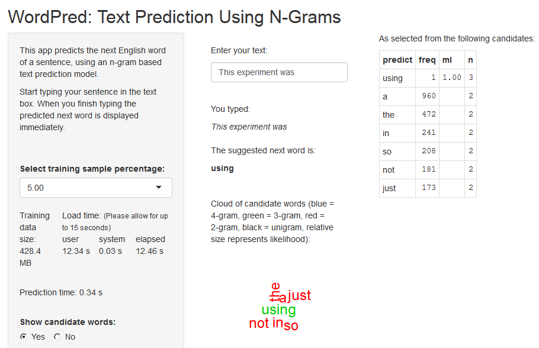

"MyWord!": Shiny Web App Demo for N-gram Text Prediction 
========================================================
author: Oliver Bailey
date: August-September 2020
css: custom.css 

Coursera / Johns Hopkins University

Data Science Specialization Capstone Project

"MyWord!": Making Typing Easier on Smartphones
========================================================

[MyWord!](https://threefeetdeep.shinyapps.io/my_word) is a web app demo that accepts typed input and predicts the next word. The target for real-world application is smartphone messaging. This implies limited memory and processing power.

- Ease of use: just start typing a sentence, the predicted next word is displayed when typing stops.
- Good user experience: initialization typically within seconds, next word prediction in less than 0.1 sec.
- Acceptable accuracy: approx. 11-12% (top suggested word, N=700 tests).
- Optional "QuadPower" mode (using quadgrams) to boost accuracy at expense of slight response time increase

"MyWord!" Key Features
========================================================

- Near-instantaneous prediction of next word
- Candidate word list with optional likelihood values
- Very small memory footprint: 
    < 4MB on flash/disk 
    < 20MB in RAM
- Written in "tidyverse" style - easy for developers to add new features

***

 

- 
Benchmark Performance (trigram mode):  Overall top-3 score: 16.36% Overall top-1 precision: 11.72 % Overall top-3 precision: 20.30 % Avg. CPU: 16.36 msec; Memory: 9.60 MB</font/

Prediction Algorithm and Implementation
========================================================

- The language model consists of 4-, 3-, 2- and 1-gram tables computed from a huge training corpus (1million+ lines of text)

- The tables are generated based on the conditional probability as follows:

$$Pr(w_{i}|w_{i-1}) = \frac {count(w_{i-1},w_{i})} {count(w_{i-1})}$$

$$\text{where } w_{i}, w_{i-1} \text{ are the last word, and n-1 preceding words.}$$

 

- The most recently entered words are matched against model data. 

- The next word prediction is the top item in the table of matches, ordered as most probable first, with a bias to prefer longer n-grams over the shorter.

Future Work & References
========================================================

- Reduce memory even further using an indexed vocabulary of words, with n-grams tables referencing this using keys

- Increase response time using data table instead of data frames (this also allow use of keys as above)

- Add ability to handle common American-English and British-English spelling variants e.g. colour/color

- Investigate if prediction accuracy improvements using smoothing approaches e.g. Kneser-Ney

Code: [Github repo](https://github.com/threefeetdeep/DataScienceCapstoneProject) App: [MyWord app](https://threefeetdeep.shinyapps.io/my_word) Refs: [Original corpus](https://d396qusza40orc.cloudfront.net/dsscapstone/dataset/Coursera-SwiftKey.zip)

THANKS!

